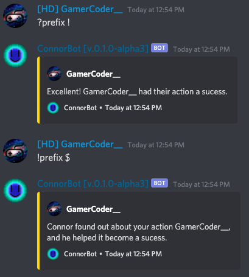
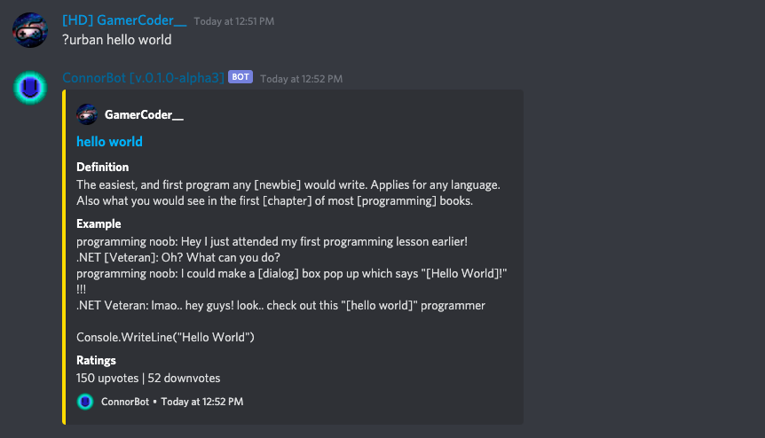

# Starter Guide

## How to Change the Bot's Prefix

Sure, you may have multiple bots that have functions Connor doesn't have. But, you're going to need a different prefix, right? Simple:


Only do this if you need to. Connor's default prefix is "**?"**



You need the **Manage Server** Permission to Run this Command.


**Some Examples**:

?prefix !

—&gt; !prefix $

—&gt; $prefix &


This will change your prefix to **!**, **$, or &.**


## How to Search something on the Urban Dictionary


This Command uses the **Urban Dictionary API**. If you need a way on how to do this for your own bot, look at the **Discord.JS Guide.**  
[https://discordjs.guide/additional-info/rest-api.html\#urban-dictionary](https://discordjs.guide/additional-info/rest-api.html#urban-dictionary)

If you aren't using the Discord.JS Library, consider searching google. 


Some computers can only support one app at once, and some people are just too lazy to open a new tab. Need a definition? Connor has you covered.

**?urban** &lt;keyword&gt;  
  
**Examples**:  
• ?urban hello world  
• ?urban dancing  
• ?urban discord


As you can see, I searched for **Hello World**, which is a commonly used starter program to test if apps or languages are working.  
The referenced page is here:  
[https://www.urbandictionary.com/define.php?term=hello+world](https://www.urbandictionary.com/define.php?term=hello+world)


